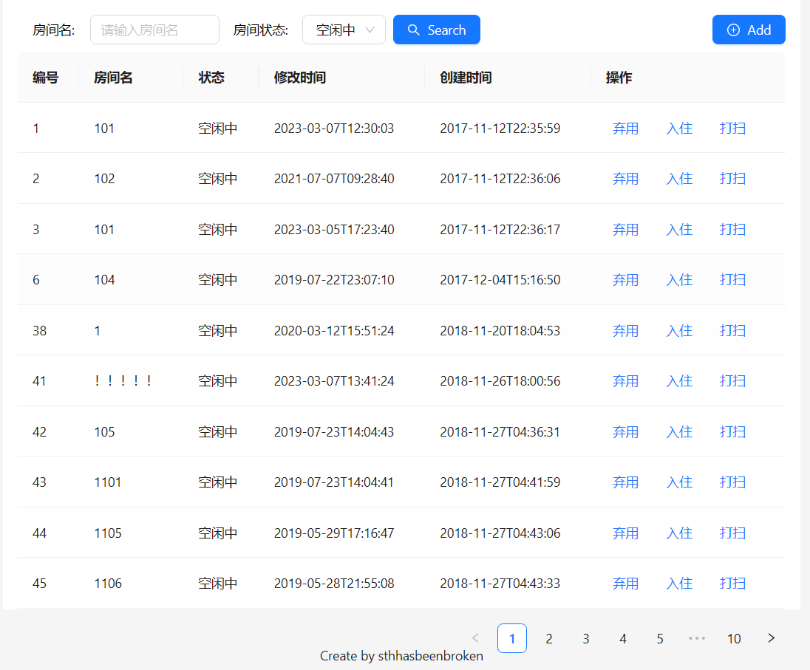

# SWW-Hotel-Challenge

START : npm start

antd install: npm install antd --save

[Introduction - Ant Design](https://ant.design/docs/spec/introduce)

[React 官方中文文档 – 用于构建用户界面的 JavaScript 库 (docschina.org)](https://react.docschina.org/)

I used the ant-design component library, this is my first time that contacting with react. Actually, I met a lot of difficulties. But luckily, I finished this challenge with my unremitting efforts. And here are some main code in my project.

```js
 /*form submit */
  const handleOk = () => {
    console.log(formVlaue)
    axios.post(`http://121.42.165.52/hotelapi/rooms`,{
      name:formVlaue,
      type:'0'
    }).then((msg)=>{
      console.log(msg)
      if(msg.data.Code===1104){
        message.open({
          type:'warning',
          content:'room name already exists'
        })
      }
      else{
        message.open({
          type:'success',
          content:'add room successfully'
        })
        setOpen(false);
      }
    }).catch(function(error){
      console.log(error)
    })
  
  };
```

```js
 /*getlist */
  const fetchData=()=>{
    axios.get('http://121.42.165.52/hotelapi/rooms/list').then(function(res){
   // console.log(res);
    for(let i = 0 ;i<res.data.Content.length;i++){
      if(res.data.Content[i].Type===0){
        res.data.Content[i].Type='空闲中'
      }
      if(res.data.Content[i].Type===1){
        res.data.Content[i].Type='已入住'
      }
      if(res.data.Content[i].Type===2){
        res.data.Content[i].Type='打扫中'
      }
      if(res.data.Content[i].Type===-1){
        res.data.Content[i].Type='废弃中'
      }
    }
    setData(res.data.Content);
    // console.log(data)
    }).catch(function(error){
        console.log(error)
    })
  }
```

```js
const search=()=>{
   
    if(searchType!==undefined && searchName===undefined){
      axios.get(`http://121.42.165.52/hotelapi/rooms/list?type=${searchType}`)
      .then(
        function(res){
          for(let i = 0 ;i<res.data.Content.length;i++){
            if(res.data.Content[i].Type===0){
              res.data.Content[i].Type='空闲中'
            }
            if(res.data.Content[i].Type===1){
              res.data.Content[i].Type='已入住'
            }
            if(res.data.Content[i].Type===2){
              res.data.Content[i].Type='打扫中'
            }
            if(res.data.Content[i].Type===-1){
              res.data.Content[i].Type='废弃中'
            }
          }
          console.log('1'+searchName,searchType)
          //console.log(res)
          setData(res.data.Content)
        }
      ).catch(function(error){
          console.log(error)
      })
    }
    else if(searchName!==undefined && searchType===undefined){
      axios.get(`http://121.42.165.52/hotelapi/rooms/list?name=${searchName}`)
      .then(
        function(res){
          for(let i = 0 ;i<res.data.Content.length;i++){
            if(res.data.Content[i].Type===0){
              res.data.Content[i].Type='空闲中'
            }
            if(res.data.Content[i].Type===1){
              res.data.Content[i].Type='已入住'
            }
            if(res.data.Content[i].Type===2){
              res.data.Content[i].Type='打扫中'
            }
            if(res.data.Content[i].Type===-1){
              res.data.Content[i].Type='废弃中'
            }
          }
          console.log('2'+searchName,searchType)
          //console.log(res)
          setData(res.data.Content)
        }
      ).catch(function(error){
          console.log(error)
      })
    }
  
    else if(searchName!==undefined && searchType!==undefined) {
      axios.get(`http://121.42.165.52/hotelapi/rooms/list?name=${searchName}&type=${searchType}`)
      .then(
        function(res){
          for(let i = 0 ;i<res.data.Content.length;i++){
            if(res.data.Content[i].Type===0){
              res.data.Content[i].Type='空闲中'
            }
            if(res.data.Content[i].Type===1){
              res.data.Content[i].Type='已入住'
            }
            if(res.data.Content[i].Type===2){
              res.data.Content[i].Type='打扫中'
            }
            if(res.data.Content[i].Type===-1){
              res.data.Content[i].Type='废弃中'
            }
          }
          console.log('3'+searchName,searchType)
          //console.log(res)
          setData(res.data.Content)
        }
      ).catch(function(error){
          console.log(error)
      })
    }
    else if(searchName===undefined && searchType===undefined){
      fetchData();
    }
  }
```

```js

 /**Action change */
  const changestate=(e,rrid)=>{
    //console.log(e)
    // setFlag(true);
    console.log(e.target.value)
    console.log(rrid)
    setRid(rrid)
      if(e.target.value==='入住'){
        setActionValue('1')
      }
      else if(e.target.value==='打扫'){
        setActionValue('2')
      }
      else if(e.target.value==='退房'){
        setActionValue('0')
      }
      else if(e.target.value==='弃用'){
        setActionValue('-1')
      }
      else if(e.target.value==='启用'){
        setActionValue('0')
      }
      else if(e.target.value==='打扫完毕'){
        setActionValue('0')
      }
      else setActionValue('0')
      fetchData()  
  }
```

```js
      /**refresh */
      useEffect(()=>{
        fetchData()
        console.log(actionValue)
        console.log(rid)
        axios.patch(`http://121.42.165.52/hotelapi/rooms`,{id:rid,type:actionValue}
          ).then(function(res){
          console.log(res);
        }).catch(function(error){
          console.log(error)
        })
        fetchData()
      // eslint-disable-next-line react-hooks/exhaustive-deps
      },[actionValue])

      useEffect(()=>{
        fetchData()
        console.log(actionValue)
        console.log(rid)
        axios.patch(`http://121.42.165.52/hotelapi/rooms`,{id:rid,type:actionValue}
          ).then(function(res){
          console.log(res);
        }).catch(function(error){
          console.log(error)
        })
        fetchData()
      // eslint-disable-next-line react-hooks/exhaustive-deps
      },[rid])

      useEffect(()=>{
        if(data.length===0){
          fetchData()
        }
        else{search()}
        }
        , // eslint-disable-next-line react-hooks/exhaustive-deps
        [JSON.stringify(data)]
        )
```

And the final outcome is like these following pics





